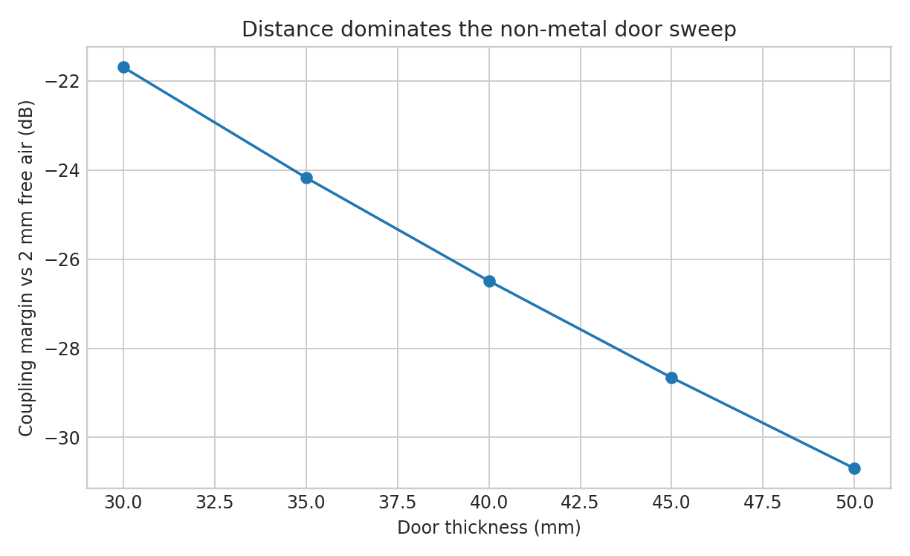
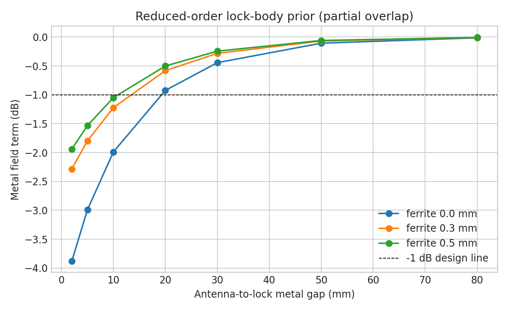
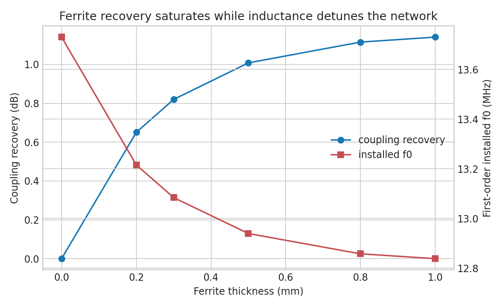
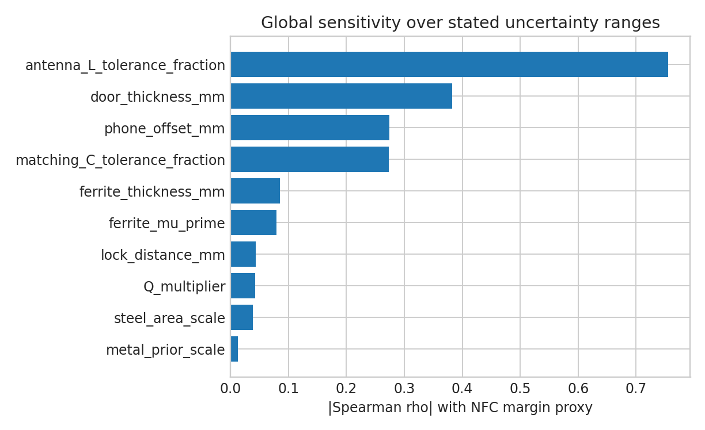
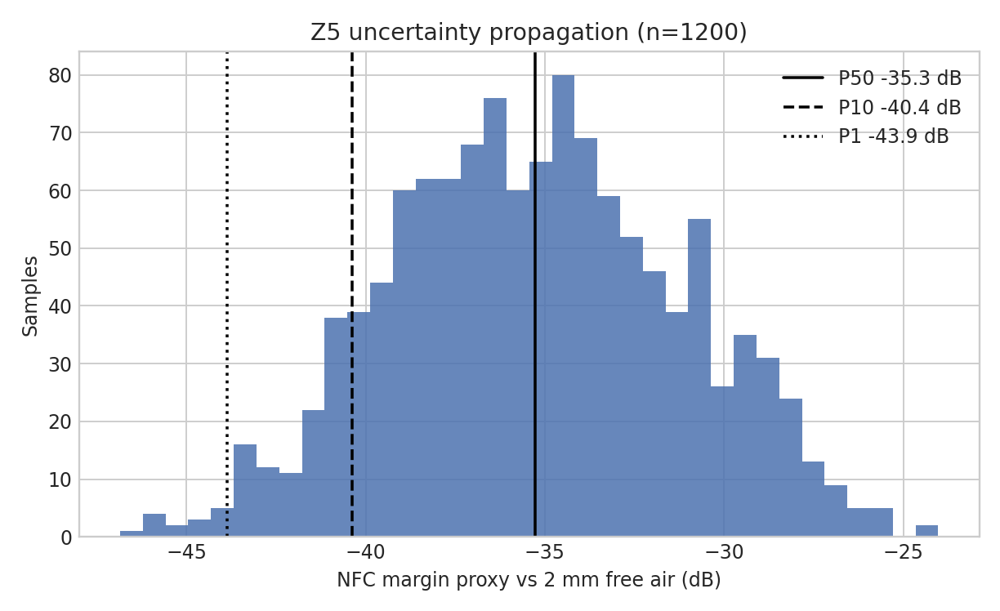

# Autolock NFC Link Model — Rev A

Generated from the authoritative KiCad board inside the Rev A review package. Model version 0.1.0. Results are relative magnetic-near-field engineering quantities, not far-field path loss and not absolute HomeKey pass/fail claims.

## A. Executive conclusion

**Rev A is worth continuing as an instrumented first-board prototype, but the model does not establish that it will unlock through a 40 mm door.** The extracted 40 mm four-turn coil is electrically plausible: independent calculation gives **L = 1.674 µH**, **RAC ≈ 1.42 Ω**, and bare-air **Q ≈ 101**. The older 1.49 µH estimate is 12.3% lower; that disagreement is small enough for a first-order formula but large enough to require VNA measurement before fixing matching values.

The non-metal door core is not the main magnetic blocker. At 40 mm thickness plus a 2 mm phone gap, the model gives **-26.5 dB coupling loss** relative to the same Phone-M equivalent at 2 mm. Almost all of that is geometric separation; the deliberately conservative composite-material term is only **-0.019 dB**.

The lock body is more dangerous than the core. The Z3 prior adds about **-1.9 dB** of coupling loss at 10 mm partial overlap, while the side frame at 50 mm adds only **-0.03 dB** in the stated geometry. A frame or reinforcement that overlaps the coil is a different, high-risk case and is not represented by the benign side-frame number.

Ferrite is worth designing into the mechanical stack, but **0.3 mm is the modeled knee**, not a free gain. In Z4, 0.3 mm medium ferrite recovers **0.85 dB** of coupling and 0.5 mm recovers **1.01 dB**; the extra 0.2 mm gives only 0.16 dB in this prior. Ferrite also raises L, moving the normalized network to 13.081 MHz at 0.3 mm and 12.939 MHz at 0.5 mm. Therefore **default 0.3 mm for the first mechanical stack, buy 0.5 mm as a comparison sample, and tune only in the final installed state**.

The first Rev B priority is mechanical/RF co-design: preserve alignment, maximize antenna-to-metal gap, reserve full ferrite coverage, and make installed matching easy. A parametric 50 mm coil improves k at 42 mm by **1.59 dB** in the simplified geometry, but it also changes L and matching; do not enlarge the antenna until Rev A measurements show that the 40 mm coil lacks margin. Matching optimization cannot recover geometric flux by itself, but an untuned ferrite stack can throw away several dB.

## B. Model assumptions

- Frequency: 13.56 MHz; quasi-static magnetic coupling because dimensions are tiny relative to wavelength.
- Tx geometry: actual KiCad turn centre-lines. H uses numerical Biot–Savart integration; M uses the Neumann line integral.
- Rx geometry: parameterized Phone-S/M/L equivalents only. They are not identified with any iPhone model.
- Reference: same phone equivalent, centered/parallel at a 2 mm free-air gap.
- Ordinary door materials have µr≈1. Their permittivity/loss ranges are retained, but door thickness enters mainly as coil separation.
- Metal and ferrite results are bounded, named priors. Their coefficients are not universal material constants.
- Air matching is normalized to the 13.56 MHz design intent. The full differential PN7161 port impedance is not known.
- `NFC margin proxy` combines 20log10(k/kref), first-order resonance response, and a stored-energy Q term. Its success threshold is intentionally null.

Core equations:

\[
M=\frac{\mu_0}{4\pi}\oint\!\oint
\frac{d\boldsymbol\ell_1\cdot d\boldsymbol\ell_2}{|\mathbf r_1-\mathbf r_2|},
\quad k=\frac{M}{\sqrt{L_1L_2}},
\quad \delta=\sqrt{\frac{2}{\omega\mu\sigma}}.
\]

The square-spiral L estimate uses Mohan's current-sheet expression. Metal is separated into field shielding, L shift, Q loss, and detuning. Ferrite enters both alone and as an explicit metal×ferrite isolation term.

## C. Baseline Rev A

| Quantity | Extracted/calculated value | Status |
|---|---:|---|
| PCB | 150 × 75 × 1.6 mm, 4 layer | KiCad/production baseline |
| AE1 placement | (48.0, 37.5) mm on F.Cu | KiCad extracted |
| Turn centre-line sides | 40.0, 38.6, 37.2, 35.8 mm | KiCad extracted |
| Copper outer extent | 40.4 × 40.4 mm | KiCad extracted |
| Turns / width / gap | 4 / 0.4 / 0.3 mm | KiCad extracted |
| Conductor length | 602.656 mm incl. 16.456 mm B.Cu crossover | KiCad extracted |
| Copper thickness | 35 µm nominal; 18–35 µm range | **not encoded in stackup; TODO verify order** |
| Lair | 1.674 µH | Mohan estimate |
| RDC / RAC | 0.742 / 1.418 Ω | RAC has proximity prior |
| Qair bare / loaded reference | 100.6 / 19.0 | loaded includes R18/R19 and estimated L3/L4 ESR |

The board drawing marks x=4–48 mm, y=16–59 mm as “NFC ANTENNA — NO METAL / NO COPPER”; official layer review found no inner-layer copper under AE1. This is a board/layout fact, not proof that the installed door has no metal.

Current RF values independently read from the design manifest/BOM are L3/L4 160 nH, C27/C28 330 pF, C29/C30 68 pF, C31/C32 100 pF, R18/R19 2.7 Ω, with C33–C36 DNP trim pads.

## D. Door material and thickness results

| Door mm | total separation mm | composite material term dB | coupling margin dB |
|---|---|---|---|
| 30 | 32 | -0.014 | -21.69 |
| 35 | 37 | -0.017 | -24.17 |
| 40 | 42 | -0.019 | -26.49 |
| 45 | 47 | -0.022 | -28.66 |
| 50 | 52 | -0.024 | -30.70 |

At fixed 40 mm thickness, every non-metal material in the database changes the magnetic result by less than 0.04 dB in this reduced model. That conclusion is robust only if the “fire-rated core” contains no sheet, mesh, foil, large fasteners, or reinforcement. Moisture-dependent dielectric ranges remain in the database, but they do not become a made-up fixed “wood door attenuation”.

## E. Metal results

| Case | H loss dB | k loss dB | L µH | loaded Q | f0 MHz | detune dB | margin proxy dB |
|---|---|---|---|---|---|---|---|
| FREE_AIR | 0.00 | 0.00 | 1.674 | 19.0 | 13.560 | 0.00 | 0.00 |
| ZETLAND_BASELINE | -20.74 | -26.49 | 1.674 | 19.0 | 13.560 | 0.00 | -26.49 |
| ZETLAND_FRAME | -20.78 | -26.52 | 1.673 | 19.0 | 13.563 | -0.00 | -26.53 |
| ZETLAND_LOCK_NEAR | -22.73 | -28.37 | 1.633 | 16.7 | 13.727 | -0.68 | -29.61 |
| ZETLAND_LOCK_FRAME | -22.77 | -28.40 | 1.632 | 16.7 | 13.731 | -0.70 | -29.68 |
| ZETLAND_LOCK_FERRITE_03 | -21.50 | -27.55 | 1.798 | 18.6 | 13.081 | -4.35 | -32.00 |
| ZETLAND_LOCK_FERRITE_05 | -21.21 | -27.37 | 1.839 | 19.1 | 12.937 | -6.10 | -33.46 |
| ZETLAND_LOCK_FRAME_FERRITE_05 | -21.24 | -27.40 | 1.838 | 19.0 | 12.939 | -6.05 | -33.45 |
| WORST_STEEL | -53.31 | -54.96 | 1.324 | 10.8 | 15.247 | -9.18 | -66.58 |

For the medium partial-overlap lock prior, the first sampled gap meeting a -1 dB metal-field design line is **20 mm without ferrite** and **20 mm with 0.5 mm medium ferrite**. These are model-derived mechanical targets, not universal NFC rules. TI's independent general guidance uses 10 mm as a baseline separation while warning that effects remain application-specific.

Skin depth at 13.56 MHz is only a few micrometres for the median mild-steel prior, so millimetre metal is already “thick” electromagnetically. That does not justify exp(-t/δ) as a whole-system link loss: finite size, edge return paths, overlap, orientation, L/Q change, and ferrite interaction dominate.

## F. Ferrite results

| Ferrite mm | recovery vs Z4 dB | L µH | f0 MHz | detune dB |
|---|---|---|---|---|
| 0 | 0.00 | 1.632 | 13.731 | -0.70 |
| 0.2 | 0.65 | 1.762 | 13.216 | -2.67 |
| 0.3 | 0.82 | 1.798 | 13.084 | -4.30 |
| 0.5 | 1.01 | 1.838 | 12.939 | -6.05 |
| 0.8 | 1.11 | 1.862 | 12.857 | -6.99 |
| 1.0 | 1.14 | 1.867 | 12.838 | -7.20 |

The recovery saturates with thickness, while L continues to move enough to require installed-state tuning. Low/medium/high permeability sweeps are in `reports/nfc_model/ferrite_sweep.csv`; the class names are ranges, not approved part numbers.

## G. Sensitivity

Sensitivity uses |Spearman ρ| against the margin proxy over the explicit Monte Carlo ranges. It is not a universal feature ranking.

| Rank | Variable | Spearman ρ | |ρ| |
|---|---|---|---|
| 1 | antenna_L_tolerance_fraction | -0.756 | 0.756 |
| 2 | door_thickness_mm | -0.382 | 0.382 |
| 3 | phone_offset_mm | -0.274 | 0.274 |
| 4 | matching_C_tolerance_fraction | -0.273 | 0.273 |
| 5 | ferrite_thickness_mm | -0.085 | 0.085 |
| 6 | ferrite_mu_prime | -0.079 | 0.079 |
| 7 | lock_distance_mm | 0.043 | 0.043 |
| 8 | Q_multiplier | -0.042 | 0.042 |

The leading electrical variable is installed L tolerance because the nominal network is held fixed; this is exactly why VNA tuning after adding ferrite/metal is a release gate. Among mechanical variables, door thickness/total separation and phone alignment dominate. Lock distance and ferrite become more important when their uncertainty is restricted to close-metal assemblies rather than the broad mixed range used here.

## H. Monte Carlo

Z5 (40 mm nominal door, lock + frame + 0.5 mm ferrite) with 1200 samples gives:

| Metric | P10 | median | P90 | worst reasonable P1 |
|---|---:|---:|---:|---:|
| coupling margin dB | -32.33 | -29.50 | -26.64 | -34.89 |
| NFC margin proxy dB | -40.37 | -35.27 | -29.63 | -43.86 |
| installed L µH | 1.715 | 1.834 | 1.951 | 1.628 |
| installed f0 MHz | 12.533 | 12.963 | 13.436 | 12.149 |

“Worst reasonable” is P1 of these stated priors, not an absolute physical bound. No synthetic success probability is attached.

## I. Installation and Rev B recommendations

1. Treat **20 mm** as the no-ferrite target from antenna copper boundary to a partial-overlap medium lock body; if the real geometry cannot meet it, use full-area NFC ferrite and target at least **20 mm** in the same model class.
2. Avoid any steel-frame or reinforcement overlap with the 40.4 mm copper outline. “Frame at the side” is safe only when the measured edge gap matches the scenario.
3. Start with **0.3 mm medium NFC ferrite** covering the entire loop plus a small margin. Also procure 0.5 mm for A/B testing; do not stack blindly.
4. Mark the outside phone target over the coil centre. At 42 mm separation, keep routine lateral error below **10 mm** and tilt below **10°** until measured maps establish more margin. The full grid is in `alignment_sweep.csv`.
5. Measure AE1 alone, then assembled. If L rises, replace C29/C30 with lower values; DNP C33/C34 can only add parallel capacitance. Use C35/C36 after the resonance direction is corrected to refine impedance/bandwidth. The example 0.3 mm Z4 prior requires about -4.7 pF change per 68 pF series branch (negative means reduce), but the VNA value wins.
6. Rev B ordering: **mechanical location/metal clearance → ferrite provision → installed matching accessibility → antenna size**. A 50 mm parametric coil has a modeled 1.59 dB k gain at 42 mm, but only after its new L/network and phone-size interaction are designed.

## J. What cannot be known yet

- exact iPhone or Apple Watch NFC antenna geometry and orientation;
- HomeKey receiver/reader threshold and PN7161 dynamic-power behavior;
- actual door internal structure, moisture, metal mesh/reinforcement, and lock-body shape;
- actual ferrite µ′, µ″, adhesive, coverage, cracks, and compression;
- copper thickness and fabricated trace tolerance;
- complex PN7161 port impedance and complete installed S-parameters.

Accordingly, `P(HomeKey success)` remains `null` in every uncalibrated output.

## K. Measurement plan

1. Add a temporary coax/VNA fixture at the antenna isolation point; perform SOL calibration at the fixture plane and sweep at least 10–20 MHz.
2. Test A: PCB in air. Record complex S11/Touchstone, f0, L, series R and Q.
3. Test B: PCB + each 0.2/0.3/0.5 mm ferrite sample. Keep spacer and coverage documented.
4. Test C: PCB on the real door but away from the lock; separates geometry/core from metal.
5. Test D: add the real lock at controlled 2/5/10/20/30/50 mm gaps and at behind/beside/partial-overlap positions.
6. Test E: complete installed assembly. Retune C29/C30 first, then C35/C36, and remeasure bandwidth/Q.
7. HomeKey map: for each phone/watch model, run at least 20 repeats per 0/10/20/30/40 mm offset and 0/10/20/30° tilt. Record response time as well as success count.
8. Feed summary data to `calibrate-vna`; retain Touchstone for a future complex-network fitter. Only after repeated trials, use `calibrate-homekey` to fit an empirical threshold.

## L. Need for further EM simulation

The reduced-order model is adequate for distance, offset, tilt, coil-size comparisons, first-order L/R/Q, material-vs-distance separation, skin-depth screening, tuning direction, and uncertainty bookkeeping.

It is **not** adequate to determine the exact loss from the real lock body, steel-frame edge, hidden reinforcement, ferrite edge/fringing, or partial overlap. These are both high-uncertainty and potentially high-sensitivity. The next EM task should therefore be narrowly scoped to **Rev A AE1 + measured lock geometry + selected ferrite + nearby frame**, first in openEMS/FEM and only then in HFSS/CST/COMSOL if needed. Do not simulate the whole door before Test C confirms that non-metal core behavior is ordinary.

## Sources

1. NXP, [PN7160 antenna design and matching guide, AN13219 Rev. 1.6](https://www.nxp.com/docs/en/application-note/AN13219.pdf).
2. NXP, [PN7160/PN7161 NFC Controller datasheet](https://www.nxp.com/docs/en/data-sheet/PN7160_PN7161.pdf).
3. Texas Instruments, [Antenna Design Guide for the TRF79xxA, SLOA241C](https://www.ti.com/lit/an/sloa241c/sloa241c.pdf).
4. S. S. Mohan et al., [Simple Accurate Expressions for Planar Spiral Inductances](https://web.stanford.edu/~boyd/papers/pdf/inductance_expressions.pdf), IEEE JSSC 34(10), 1999, doi:10.1109/4.792620.
5. TDK, [RFID/NFC magnetic sheet product data](https://www.tdk-electronics.tdk.com/download/140970/f46250e00025633e241b63ef5ee8c174/product-survey-pp.pdf).
6. TDK, [IFQ06 NFC magnetic sheet overview](https://www.tdk-electronics.tdk.com/en/374108/tech-library/articles/products-technologies/products-technologies/tdk-introduces-new-ifq06-ultra-thin-magnetic-sheets-with-high-permeability-for-nfc-applications-/3159212).
7. USDA Forest Products Laboratory, [Dielectric properties of wood and hardboard, 20 Hz–50 MHz, FPL-RP-245](https://www.fpl.fs.usda.gov/documnts/fplrp/fplrp245.pdf).
8. NIST, [Measurement of Materials Dielectric Properties](https://www.nist.gov/publications/measurement-materials-dielectric-properties).

Material ranges and per-field provenance are machine-readable in `tools/nfc_model/data/materials.json`. All reduced-order calibration priors are named in `metal.py` and `ferrite.py`; unknowns use ranges/TODO measurement rather than fabricated precision.
